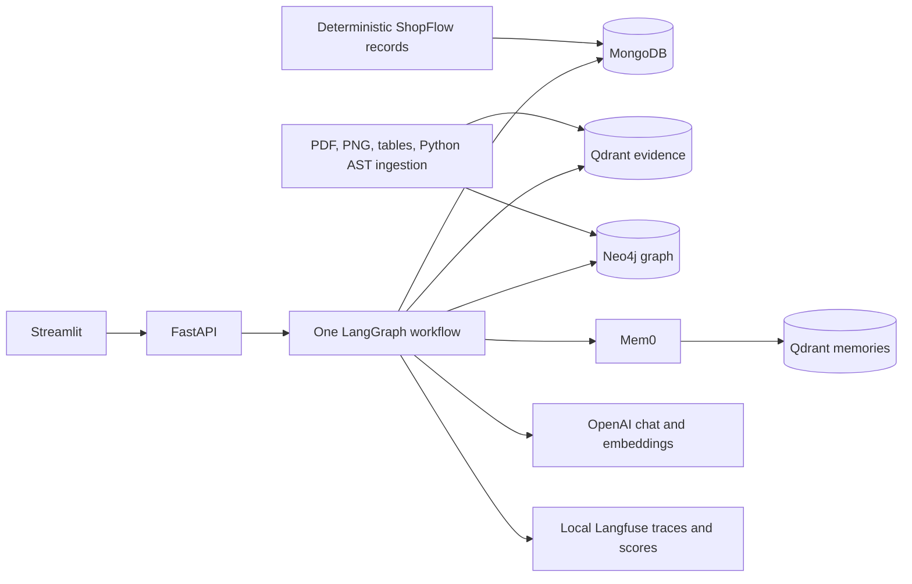
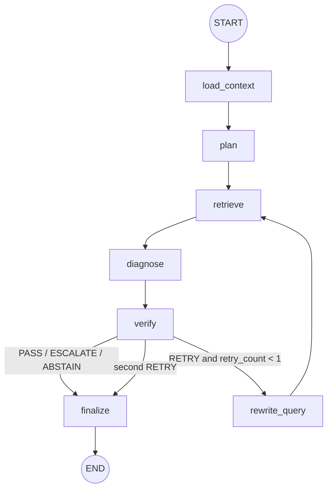

# SupportOps

SupportOps helps support staff investigate tickets for ShopFlow, a fictional e-commerce company.
It runs locally and brings together customer records, policy PDFs, screenshots, past incidents,
source code, service relationships and approved memories.

It suggests a diagnosis and drafts a response for a person to review. It cannot send messages,
issue refunds, change orders or modify accounts.

## Example

Ananya Sharma reports that ShopFlow captured ₹2,499 while her order is marked `FAILED`.
SupportOps compares the MongoDB records with an approved earlier resolution, the payment policy
and incident `INC-001`. It also inspects `handle_payment_callback` and traverses
`PaymentService` relationships. A likely explanation is a callback synchronization failure.
The recommendation may be reconciliation
or engineering escalation, with citations for each material claim. A reviewer can approve,
edit, escalate or reject the draft.

## Architecture



Each store handles a different part of the investigation:

| Component | Responsibility |
| --- | --- |
| MongoDB | Exact customers, orders, payments, tickets, runs, reviews, and ingestion metadata |
| Qdrant | `supportgraph_evidence` dense OpenAI and sparse BM25 evidence retrieval |
| Neo4j | Bounded service, incident, policy, error, and Python symbol relationships |
| Mem0 OSS | Approved customer history, resolutions, corrections, and team preferences in `supportgraph_memories` |
| Langfuse OSS | Local LangGraph traces, model latency/cost, sessions, and human-review scores |

Mem0 uses Qdrant only. Neo4j is accessed directly with the official driver and is not configured
as a Mem0 graph store.

## Ingestion

`scripts/build_demo_assets.py` generates the fictional documents, images and sample repository
from fixed definitions. The ingestion service:

1. extracts page-aware PDF text and tables, using Docling for available structure and PyPDF for
   stable page provenance;
2. asks the fast vision model for typed visible text and UI state from each PNG, retaining the
   original path and hash;
3. parses the demo Python repository with `ast`, producing evidence for modules, classes, and
   functions, plus conservative imports, calls, and endpoint relationships;
4. embeds evidence with `text-embedding-3-small` and adds FastEmbed BM25 sparse vectors;
5. upserts Qdrant points, Neo4j nodes/edges, and MongoDB source metadata with stable IDs.

Customer, order, and payment rows are never embedded. They are retrieved exactly from MongoDB.
Indexed content is treated as untrusted evidence, never executable instructions. Indexed source
code is not run.

## Investigation workflow

The LangGraph workflow has seven nodes and allows one retrieval retry.



The workflow loads exact records first. The planner chooses which other sources to search and
writes up to three focused queries. Search combines dense and BM25 rankings with reciprocal-rank
fusion, then combines results across queries the same way. Filters include shared guides.
Required policies are fetched directly for both the ticket's category and the planner's category.

The reranker selects up to eight optional items. Required records and policies always stay in
the evidence set. Selected PDF chunks expand to nearby text on the same page, and duplicate
parent blocks are removed. The text budget is 32,000 characters. If required sources are missing
or too large, the workflow abstains; it does not cut policy text to fit. Parent context comes
from the original document, without a generated prefix.

Graph traversal finds source chunks that can be cited. Graph summaries and relationships are not
used as proof of a cause. Diagnosis and verification receive the same evidence set. Each material
claim records its type, evidence IDs and limitations. Code and past incidents can suggest a cause,
but cannot confirm what happened in the current ticket. The verifier checks the full draft,
including policy conditions and conflicting sources. It checks what citations support, not just
whether their IDs exist.

A targeted retry must find new evidence to continue. Otherwise, the result is marked insufficient.
Security reports require escalation. Only a PASS result can be approved; other outcomes show a
holding response. Failed runs are saved with a generic error. The API returns the steps taken,
tool choices, evidence IDs, timings and verdicts, but no private reasoning.

## Prompts and models

The prompts in `app/agent/prompts.py` define each stage's job and evidence rules. Short
input/output examples show how to route tickets, select evidence, distinguish customer reports
from verified facts, handle uncertain causes, choose a verifier outcome, retry a search and
decide whether a review contains anything worth remembering. These few-shot examples are
fictional demonstrations, not ShopFlow policies or evaluation answers.

The diagnosis prompt asks for a final consistency check. A separate verifier applies explicit
criteria for each verdict. Instructions and source data are sent in separate messages, and
reranking candidates use JSON. This helps separate instructions from evidence, but does not
prevent every prompt-injection attempt. Schema validation and checks in the application still apply.

Completed runs store `prompt_version` so results can be traced to a prompt revision. Offline
tests check the examples' schemas and references; they do not measure model accuracy. To compare
revisions, use the same cases and model settings, then review claims against the saved evidence
as described under Evaluation. Examples add input tokens, so retain those that help with actual
failure cases.

The prompting approach follows [OpenAI's prompt engineering guidance](https://developers.openai.com/api/docs/guides/prompt-engineering)
and [reasoning best practices](https://developers.openai.com/api/docs/guides/reasoning-best-practices):
clear constraints, separate instructions and data, consistent examples and checks on the result.

Model names and reasoning effort levels are set through environment variables. If a configured
model is unavailable, the run fails without switching models. The API returns an error and run ID;
diagnostic details stay in the server logs. Check that your account can access the selected models.

| Work | Default |
| --- | --- |
| Classification, query rewriting, screenshot description, reranking, memory distillation | `gpt-5.6-luna`, low effort |
| Diagnosis, response drafting, evidence/policy verification | `gpt-5.6-terra`, medium effort |
| Document, incident, screenshot, code, and memory embeddings | `text-embedding-3-small`, 1,536 dimensions |

## Demo dataset

The repository includes 12 customers, 19 orders and matching payments, 24 tickets (12 current and
12 resolved/closed), four policies, two operational guides, four incident reports, four support
screenshots, an architecture diagram, a small seven-module FastAPI repository, and 20 JSONL
evaluation cases. All people and records are fictional.

The fixtures include several discrepancies: a callback can fail before reconciliation is
scheduled, the upload guide says 5 MB while code enforces 4 MB, a refund incident violated the
five-business-day SLA, and unknown payments require mandatory escalation.

## Setup on Windows PowerShell

Prerequisites: Python 3.12 (or let `uv` download it),
[uv](https://docs.astral.sh/uv/), Docker Desktop, and an OpenAI API key with access to the
configured models.

```powershell
Copy-Item .env.example .env
# Edit .env and set OPENAI_API_KEY.
docker compose up -d
uv sync
uv run python scripts/seed_demo.py
uv run pytest -q
uv run ruff check .
uv run ruff format --check .
```

Start the API:

```powershell
uv run uvicorn app.main:app --host 127.0.0.1 --port 8000 --reload
```

In a second terminal, start the UI:

```powershell
uv run streamlit run ui/app.py
```

The UI reads `API_URL` from the project's `.env` file. If port 8000 is used by
another app, start SupportOps with `--port 8019` and set
`API_URL=http://127.0.0.1:8019` in `.env`. Restart Streamlit after changing this
setting. An existing shell `API_URL` takes precedence over `.env`.

## Setup on Unix

```bash
cp .env.example .env
# Edit .env and set OPENAI_API_KEY.
docker compose up -d
uv sync
uv run python scripts/seed_demo.py
uv run pytest -q
uv run ruff check .
uv run ruff format --check .
uv run uvicorn app.main:app --host 127.0.0.1 --port 8000 --reload
```

Run `uv run streamlit run ui/app.py` in another shell.

The seed command builds missing assets, checks the services, creates indexes, upserts records
and evidence, builds graph relationships, and adds missing approved seed memories.
Without `--reset`, it uses SHA-256 hashes to reuse unchanged files and compares each chunk's
content hash and embedding model before requesting a new embedding. It saves source metadata
after indexing succeeds and removes obsolete Qdrant chunks from each reindexed source.
An unchanged rerun reports `evidence=0` and makes no corpus-embedding calls.
Use `--reset` for a full rebuild only: it deletes the evidence collection and regenerates
its vectors.

Docling is enabled by default. On a low-disk machine that cannot cache Docling's layout model, set
`DOCLING_ENABLED=false` for a page-aware PyPDF-only seed; this skips Docling structure enrichment
but retains PDF text, table rows, page numbers, and citation provenance.

## Local Langfuse observability

Langfuse runs entirely on the local machine in a separate, isolated Compose project. Its web and
MinIO endpoints bind only to `127.0.0.1`; Postgres, ClickHouse, Redis, and the worker have no host
ports. The local stack uses the official Langfuse v4 topology and persists data in named volumes.

```powershell
docker compose --env-file .env.langfuse -f docker-compose.langfuse.yml up -d
docker compose --env-file .env.langfuse -f docker-compose.langfuse.yml ps
uv run python scripts/check_langfuse.py
```

Open `http://127.0.0.1:3000`. The local login is stored in the gitignored `.env.langfuse` file.
The organization, project, user, and API keys are created automatically on the first start.

Investigations create one trace per `run_id`, group ticket runs by LangGraph thread, and trace graph
nodes plus nested model calls. Human review creates `human_approval` and `review_decision` scores.
Embedding spans record counts and model metadata but never raw evidence text. A client-side export
mask removes API keys, email addresses, payment-card-like numbers, and inline base64 images before
they reach Langfuse storage.

Stop Langfuse without deleting its telemetry:

```powershell
docker compose --env-file .env.langfuse -f docker-compose.langfuse.yml stop
```

Set `LANGFUSE_ENABLED=false` in `.env` to run SupportOps without tracing. Do not add `-v` to a
Compose down command unless you intentionally want to delete all local Langfuse data.

## API

| Method | Path | Purpose |
| --- | --- | --- |
| GET | `/health` | Separate MongoDB, Qdrant, Neo4j, Mem0, and local Langfuse readiness |
| GET | `/tickets` | List tickets; filter by `status`, `category`, or `customer_id` |
| GET | `/tickets/{ticket_id}` | Ticket plus safe customer, order, and payment context |
| POST | `/tickets/{ticket_id}/investigate` | Run the bounded LangGraph investigation |
| GET | `/runs/{run_id}` | Persisted result, evidence, citations, graph paths, and concise trace |
| POST | `/runs/{run_id}/review` | `APPROVE`, `EDIT_AND_APPROVE`, `ESCALATE`, or `REJECT` |
| GET | `/customers/{customer_id}/memories` | Safe approved memories for the demo customer |
| GET | `/graph/tickets/{ticket_id}` | Bounded nodes and edges for the evidence view |
| POST | `/ingestion/run` | Localhost-only, idempotent demo ingestion |

Example investigation:

```powershell
Invoke-RestMethod -Method Post `
  -Uri http://127.0.0.1:8000/tickets/TKT-1001/investigate `
  -ContentType application/json -Body '{"question":"Why do the payment and order disagree?"}'
```

## Upgrade an existing installation

Internal package names, environment variables and database collection names retain
`supportgraph` for compatibility. Restart the API and Streamlit after updating.
With the API running, refresh evidence without reseeding customer records or resetting stores:

```powershell
Invoke-RestMethod -Method Post -Uri http://127.0.0.1:8000/ingestion/run
```

Use your configured API port. The first refresh adds parent context and ingestion version metadata;
it can call the configured vision and embedding models. This command is a data operation, not part
of the offline tests. Create a new evidence collection if you change embedding dimensions.

Investigate tickets again to obtain claim-linked results. New reviews are embedded atomically in
their investigation run; legacy entries in the separate reviews collection remain unchanged.
Repeated identical review submissions return the saved decision; conflicting submissions return 409.
Approvals require READY_FOR_REVIEW and PASS, including edited approvals. Human edits are recorded,
but are not automatically reverified or treated as proof of a successful customer action.
Memory writes have a separate state: WRITTEN, SKIPPED, FAILED, or pending. A memory failure does
not undo the review. Retry it from the UI or POST `/runs/{run_id}/memory/retry`.

## Demo walkthrough

1. Open SupportOps and select `TKT-1001` for Ananya Sharma in the support inbox.
2. Point out order `FAILED`, payment `CAPTURED`, ₹2,499, and `PAYMENT_SYNC_502` in the screenshot.
3. Click **Investigate ticket**. Show the previous approved Mem0 resolution, payment policy, `INC-001`,
   `handle_payment_callback`, exact MongoDB values, and bounded `PaymentService` graph evidence.
4. Read the reconciliation/engineering recommendation, claim references, limitations, verifier result,
   and seven-node trace. Note that no customer action happened.
5. Choose **Edit and approve**, save a review, then open **Customer history** to show any useful
   review-derived recommendation. Approval does not mean that reconciliation succeeded.
6. Select `TKT-1005` for Neha Singh and investigate. Show mandatory human escalation and the absence
   of an automatic resolution or unsupported reassurance.

## Evaluation

Offline mode validates the 20 evaluation case fixtures. It does not produce predictions or
model-quality scores:

```powershell
uv run python scripts/evaluate.py --mode offline
```

With seeded services and the API running, live mode executes the real graph and spends model credits:

```powershell
uv run python scripts/evaluate.py --mode live
```

Live mode saves actual runs, evidence, latency and per-case failures under `reports/`. Reports
measure completion, category and escalation agreement, required-source recall, citation and
claim-reference resolution, and verifier pass rate. Empty citations and claims do not count as
valid. Forbidden-phrase matches are only review flags; negations can also match.

Recalculate a report without another model request:

```powershell
uv run python scripts/evaluate.py --mode replay --results reports/runs_<timestamp>.json
```

Reference resolution is not factual grounding, and verifier agreement is not answer accuracy.
Review saved claims against the actual evidence for policy correctness, causal uncertainty and
safe recommendations. These are synthetic demo cases, not an independent production benchmark.
No live quality score is claimed by the offline tests. Historical offline reports from earlier
versions copied expected labels into predictions and must not be presented as performance.

Integration checks are excluded by default. Run them explicitly after services are healthy:

```powershell
$env:SUPPORTGRAPH_INTEGRATION = "1"
uv run pytest -q -m integration
```

## Design decisions

- One LangGraph workflow controls the investigation. Each node handles one stage.
- Pydantic models define LLM outputs and API contracts. Models, timeouts, retries, and embeddings
  are constructed in one module.
- MongoDB lookups and Neo4j traversals are application-owned and parameterized. User input is never
  turned into Cypher, and graph depth and output size are capped.
- Citations are stable IDs attached at ingestion or exact-record retrieval. The verifier rejects a
  citation that is not in the retrieved set before asking a model to judge broader support.
- Only an approval or edited approval writes review-derived memory. Rejection never creates a
  positive resolution memory, and no full customer history is logged.
- Test settings and injected fakes make the complete workflow testable without Docker or OpenAI.

## Limitations

- Python call resolution is intentionally conservative. It recognizes statically identifiable
  local free-function calls. Import aliases, receiver calls, runtime dispatch and dependency
  injection require fuller binding analysis and are not resolved.
- Generated PDFs are simple internal fixtures. Docling contributes structure where available;
  PyPDF remains the page-provenance path for these deterministic documents.
- Screenshot extraction depends on the configured vision-capable fast model. It describes only
  visible content and is not a general image-understanding system.
- The demo has no authentication and binds its databases and API to localhost. It is an interview
  project, not a production deployment.
- LangGraph checkpoint persistence is not enabled: investigation results and trace are persisted in
  MongoDB, while graph execution is synchronous and bounded.
- The index refresh is not a cross-database transaction. Neo4j is a navigation index and may retain
  old links after source edits; missing Qdrant chunks are not accepted as evidence. A full graph
  replacement and multi-worker ingestion coordination are future work.
- A process crash during a memory write can leave its state WRITING. Inspect the saved review and
  memory before manually returning that state to FAILED; automatic lease recovery is not implemented.
- Prompt boundaries and the verifier reduce risk but do not eliminate prompt injection or model
  mistakes. Human review remains necessary. Authentication and reviewer identity are not implemented.
- Contextual retrieval and richer multimodal retrieval are not implemented.
- Live model behavior and availability depend on the configured account and model access. Offline
  tests and evaluation do not predict live-model quality.

## License and attribution

Project code and generated fictional assets are licensed under the MIT License in [LICENSE](LICENSE).
The implementation uses published Python packages through their normal APIs; no repository source
code was copied into this project. Dependency licenses remain with their respective authors.
